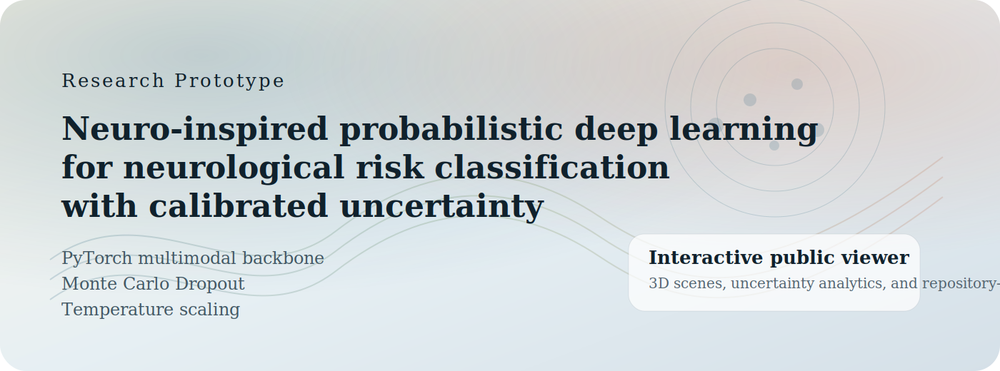
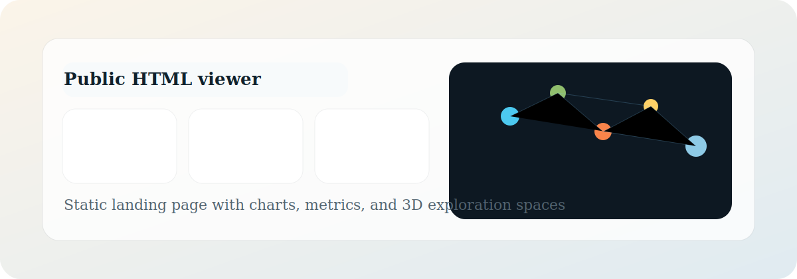
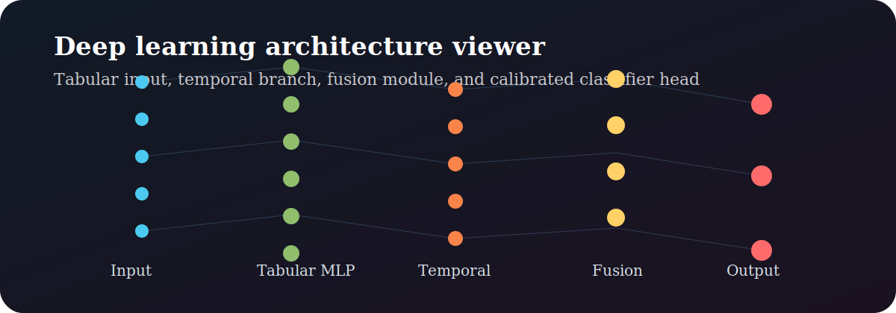

# Neuro-inspired probabilistic deep learning framework for neurological risk classification with calibrated uncertainty

<p align="center">
  
</p>

<p align="center">
  
  
  
  
  
</p>

Research prototype for neurological risk stratification using probabilistic deep learning, calibrated confidence estimation, explicit predictive uncertainty, and a public-facing interactive HTML viewer.

## Responsible Use

This repository is intended for research, prototyping, and decision-support exploration only.

- It does not replace medical evaluation.
- It is not a clinical diagnosis system.
- Softmax confidence must not be interpreted as clinical certainty.
- Predictive uncertainty should always be displayed alongside class probabilities.
- The current MVP uses synthetic placeholder data for pipeline validation, not clinical performance claims.

## Project Overview

This project provides a modular PyTorch foundation for:

- multiclass neurological risk classification,
- Monte Carlo Dropout uncertainty estimation,
- post-hoc temperature scaling,
- future multimodal expansion across tabular, temporal, and biomarker inputs,
- static and interactive scientific visualization,
- a public HTML viewer designed to make the work accessible beyond the backend.

## Visual Overview

<p align="center">
  
  
</p>

## Repository Structure

- `src/neuro_risk/`: main Python package.
- `src/neuro_risk/data/`: synthetic data generation, splits, normalization, and datasets.
- `src/neuro_risk/models/`: tabular backbone, temporal branch, and fusion module.
- `src/neuro_risk/training/`: training, validation, and temperature scaling.
- `src/neuro_risk/inference/`: deterministic inference and MC Dropout routines.
- `src/neuro_risk/evaluation/`: classification and calibration metrics.
- `src/neuro_risk/viz/`: static plots, interactive plots, and `jsviz` payload generation.
- `scripts/run_neuro_risk_mvp.py`: lightweight end-to-end MVP run.
- `scripts/infer_neuro_risk.py`: calibrated inference from a saved checkpoint.
- `notebooks/neuro_risk_research_prototype.ipynb`: main exploration notebook.
- `jsviz/`: public HTML and JavaScript visualization layer.
- `docs/`: technical architecture and responsible-use documentation.

## MVP Scope

The MVP currently implements:

- multiclass classification in PyTorch with logits and deferred `softmax`,
- a deep MLP backbone for tabular biomedical features,
- a lightweight 1D temporal branch for EEG-like or physiological sequences,
- a simple fusion module for multimodal expansion,
- Monte Carlo Dropout with:
  - mean predictive probability,
  - class-wise predictive variance,
  - predictive entropy,
  - mutual information,
- post-training temperature scaling on the validation split,
- `accuracy`, `F1 macro`, `AUROC`, confusion matrix, and `ECE`,
- static figures with `matplotlib` and `seaborn`,
- interactive plots with `plotly`,
- a repository-ready public viewer in `jsviz/`.

## Current MVP Results

The figures below come from the current lightweight pipeline on synthetic placeholder data. They should be read as system-integrity reference metrics, not as evidence of clinical validity.

| Inference Regime | Accuracy | F1 Macro | AUROC OvR | ECE | NLL |
| --- | ---: | ---: | ---: | ---: | ---: |
| `raw_test` | 0.743 | 0.720 | 0.930 | 0.105 | 0.545 |
| `calibrated_test` | 0.743 | 0.720 | 0.929 | 0.071 | 0.544 |
| `mc_dropout_test` | 0.771 | 0.758 | 0.935 | 0.132 | 0.549 |

Technical interpretation:

- temperature scaling improves deterministic calibration by reducing `ECE`,
- `MC Dropout` improves `accuracy`, `F1 macro`, and `AUROC`,
- the project is intentionally designed to expose uncertainty rather than hide it behind top-1 probability alone.

## Running the Project

Activate the local environment:

```bash
cd /home/agi/deeplearning.py
source .venv/bin/activate
```

Optionally export project-local runtime directories:

```bash
source scripts/common_env.sh
export_project_env
```

Run the lightweight MVP:

```bash
python scripts/run_neuro_risk_mvp.py --epochs 6 --mc-samples 8 --device cpu
```

Run calibrated MC Dropout inference from the saved checkpoint:

```bash
python scripts/infer_neuro_risk.py --mc-samples 10 --device cpu
```

Run the unit tests:

```bash
PYTHONPATH=src python -m unittest discover -s tests
```

Start Jupyter:

```bash
./scripts/start_jupyter.sh
```

Start the HTML viewer locally:

```bash
cd /home/agi/deeplearning.py/jsviz
npm run dev
```

## Public HTML Viewer

The `jsviz/` frontend is designed as a public-facing scientific interface for the repository and is ready for static deployment.

- `jsviz/index.html`: narrative landing page.
- `jsviz/main.js`: charts, 3D scenes, and payload-driven rendering logic.
- `jsviz/public/latest_inference.json`: static analytical snapshot for the viewer.
- `.github/workflows/deploy-jsviz-pages.yml`: GitHub Pages deployment workflow.
- `.github/workflows/ci.yml`: continuous integration for Python and frontend validation.

The viewer includes:

- summary metric cards,
- a chart gallery,
- confusion-matrix heatmaps,
- a neuroscientific 3D exploration space,
- an artificial neural network 3D exploration space,
- static navigation suitable for repository visitors and static hosting.

## Live Viewer Deployment

The repository already includes a GitHub Pages workflow for the public HTML frontend. After pushing `main` and enabling Pages in the repository settings, the viewer will be available at:

`https://gabriel-lab-ia.github.io/Neuro-probabilistic-risk-deep-learning/`
or
https://gabriel-lab-ia.github.io/Neuro-probabilistic-risk-deep-learning/

Deployment notes:

- `jsviz/vite.config.js` uses a relative base path for static hosting compatibility.
- `.github/workflows/deploy-jsviz-pages.yml` builds `jsviz/` and publishes `jsviz/dist`.
- `jsviz/public/latest_inference.json` is committed so visitors can inspect the 3D viewer and charts without running the backend locally.

## Generated Artifacts

After running the MVP, the main generated artifacts are:

- `data/processed/neuro_risk_placeholder/`: synthetic `train`, `validation`, and `test` splits.
- `models/neuro_risk/neuro_risk_mvp.pt`: model checkpoint, learned temperature, and training history.
- `outputs/neuro_risk/report.json`: metrics before and after calibration, plus MC Dropout results.
- `outputs/neuro_risk/figures/`: confusion matrix, logits, probability heatmap, confidence, and uncertainty plots.
- `outputs/neuro_risk/interactive_uncertainty.html`: interactive uncertainty scatter plot.
- `jsviz/public/latest_inference.json`: payload consumed by the public HTML viewer.

## Technical Notes

- The classifier returns logits; `softmax` is applied only in inference and analysis pathways.
- MC Dropout keeps dropout active during inference in order to sample stochastic subnetworks and approximate a posterior-like predictive distribution.
- Temperature scaling is fit on the validation split and assessed through calibration-oriented metrics such as `ECE` and `NLL`.
- The synthetic generator intentionally introduces partial class overlap to produce non-trivial uncertainty in the MVP.
- The architecture remains intentionally modular and lightweight to support future EEG, tabular clinical, biomarker, and multimodal expansion.

## Repository Standards

- Lightweight unit tests in `tests/`.
- CI for Python checks and frontend build validation.
- Dedicated GitHub Pages deployment workflow for the public viewer.
- Supporting technical documentation under `docs/`.
- Contribution guidance in `CONTRIBUTING.md`.
- Security and responsible-use guidance in `SECURITY.md`.

## Workspace Notes

The workspace is isolated through local `.cache/`, `.ipython/`, and `.jupyter` directories to avoid cross-project contamination. The local Jupyter kernel can be refreshed with `./scripts/register_kernel.sh`, and `./scripts/validate_workspace.sh` remains available for non-heavy environment validation.
